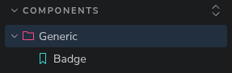
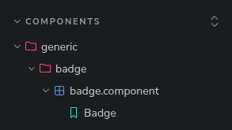
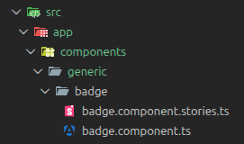

# Storybook Auto Titles

Human-readable, automatically generated Storybook sidebar titles — zero per-story boilerplate.

Automatically transform Storybook’s implicit auto-titles into clean, readable, hierarchical groups based on your file structure.

# Support Me

If you find the this useful, consider:

- Donating Ko-fi: https://ko-fi.com/deniszholob
- Supporting on Patreon: https://www.patreon.com/deniszholob

# 🧩 Example

See https://deniszholob.github.io/storybook-auto-title/ for example storybook deployment

## With @deniszholob/storybook-auto-titles

```
Components/Generic/Badge
```

[](screenshots/component-sb-auto-title.png)

## Default Storybook titles

```
Components/generic/badge/badge.component/Badge
```

[](screenshots/component-sb-default-title.png)

## File tree

```
src/app/components/generic/badge/badge.component.stories.ts
```

[](screenshots/component-location.png)

# 📦 Installation

## From npm

```bash
pnpm add -D @deniszholob/storybook-auto-titles
# or
npm i -D @deniszholob/storybook-auto-titles
# or
yarn add -D @deniszholob/storybook-auto-titles
```

## Local install (no npm registry)

Download release asset https://github.com/deniszholob/storybook-auto-title/releases

```bash
pnpm add -D storybook-auto-titles-<version>.tgz
```

# 🚀 Usage

## .storybook/main.ts

```ts
import type { StorybookConfig } from '@storybook/angular';
import { withFlattenedAutoTitles } from '@deniszholob/storybook-auto-titles';

const config: StorybookConfig = {
  stories: ['../src/**/*.stories.@(ts|tsx|js|jsx|mdx)'],
  experimental_indexers: withFlattenedAutoTitles(),
};

export default config;
```

# ⚙️ Configuration

```ts
experimental_indexers: withFlattenedAutoTitles({
  stripPrefixes: ['libs/', 'src/app/'],
  dedupeAdjacent: true,
});
```

## Options

| Option           | Type                  | Default    | Description                                     |
| ---------------- | --------------------- | ---------- | ----------------------------------------------- |
| stripPrefixes    | `string[]`            | `[]`       | Removes leading path segments before processing |
| dedupeAdjacent   | `boolean`             | `true`     | Removes repeated adjacent folder names          |
| segmentTransform | `(segment) => string` | Title Case | Custom label formatter                          |
| flattenTitle     | `(title) => string`   | internal   | Full override for custom pipelines              |

# ✨ Features

- ✅ Storybook 8, 9, and 10+ compatible (storybook versions with experimental_indexers)
- ✅ Framework agnostic (Angular, React, Vue, Web Components, etc.)
- ✅ Keeps Storybook’s auto-title logic (uses `makeTitle`)
- ✅ Converts kebab-case / snake_case / dotted names → Title Case
- ✅ Removes noisy suffixes like `.component` and `.stories`
- ✅ Deduplicates repeated path segments
- ✅ Optional prefix stripping (`src/app`, `libs/ui`, etc.)
- ✅ No changes required in your story files
- ✅ ESM + CJS compatible
- ✅ Monorepo and Nx friendly

# 🧠 Why this exists

Without this, you would either:

- manually setting `title` in every story to achieve pretty title (hard to manage)
- use the defaults (not as friendly, and requires more clicks)

# 🏗 How it works

We hook into Storybook’s experimental indexer API and:

1. Ask Storybook for the correct implicit title via `options.makeTitle()`
2. Transform the result into a human-readable hierarchy
3. Remove stale `__id` values so HMR and CSF imports stay stable
